# Дипломный практикум в Yandex.Cloud
## Задание 1. Создание облачной инфраструктуры.
Для начала необходимо создать  S3 хранилище и сервисные аккаунты. Для этого воспользуемся манифестом из директории [storage](https://github.com/Kabanitos/netology-diplom/tree/main/storage)

Dashboard Yandex Cloud
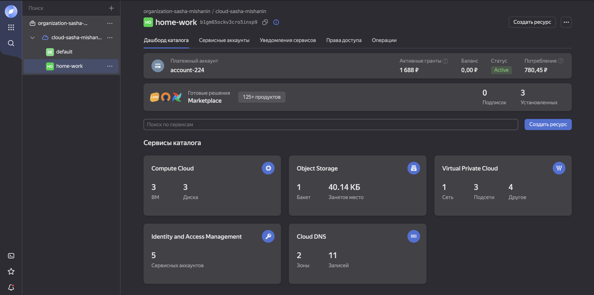

Созданные сервисные аккаунты (vmmanger и sa-backet)
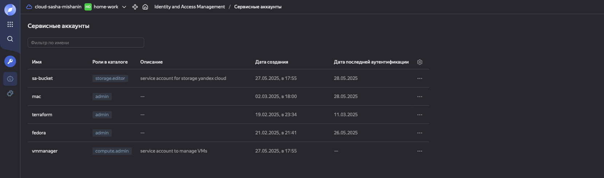

Созданное S3 хранилище.
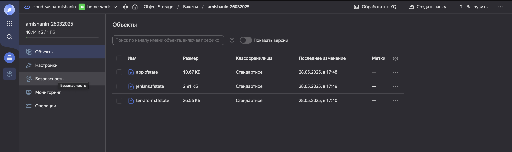

Даллее для создание инфраструктуры воспользуемся  манифестом из директории [terraform](https://github.com/Kabanitos/netology-diplom/tree/main/terraform).

Который создаст VPC c 3 подсетями в разных зонах доступности.

Созданные VPC c 3 подсетями.
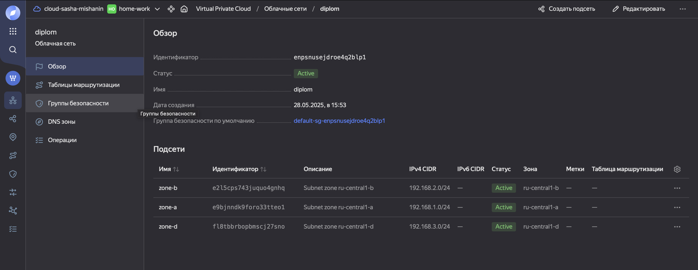

Созданные 3 виртуальные машины для Kubernetes cluster.
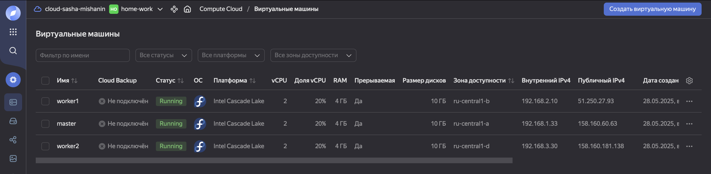

## Задание 2. Создание Kubernetes кластера.

После создание инфраструктуры манифест в директории [terraform](https://github.com/Kabanitos/netology-diplom/tree/main/terraform) поднимает Kubernetes cluster проигрывая playbook [kubesrey](https://github.com/Kabanitos/netology-diplom/tree/main/kubesprey)

В итоге получаем работающий Kubernetes cluster
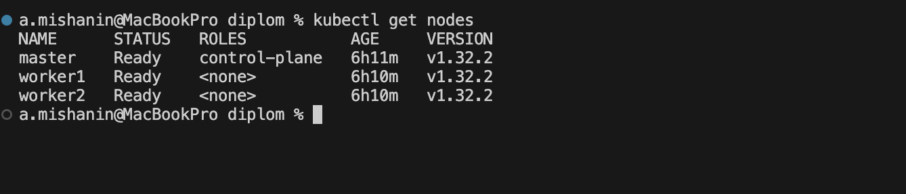

Данные для доступа к кластеру формируется автомотически и переноситься в домашнию директорию.
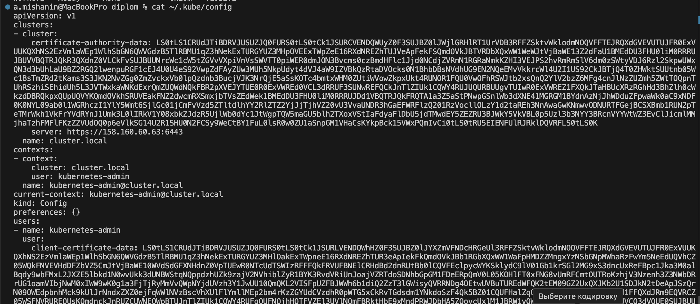

## Задание 3. Создание тестового приложения.
В директории [docker](https://github.com/Kabanitos/netology-diplom/tree/main/docker) находиться тестовое приложение [Dockerfile](). Данное приложение опубликовано [DockerHub](https://hub.docker.com/r/cabanitos/mynginx)

Тестовое приложение
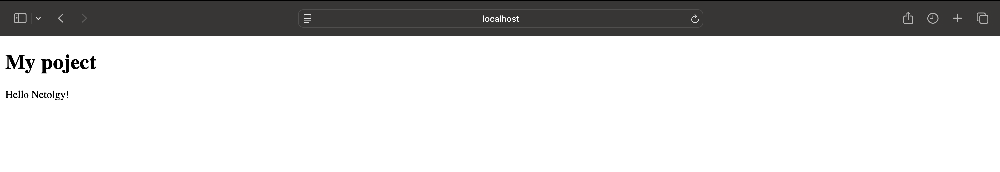

## Задание 4. Подготовка cистемы мониторинга и деплой приложения.
Для деплоя мониторинга Prometheus Grafana необходимо воспользоваться манифестом terraform из директории [monitoring_and_app](https://github.com/Kabanitos/netology-diplom/tree/main/monitoring_and_app). Итог мы получаем разврнутое систему мониторинга Prometheus-Grafana, котрый мониторит наш Kubernetes cluster.

Dashboard Grafana доступный по 80 порту
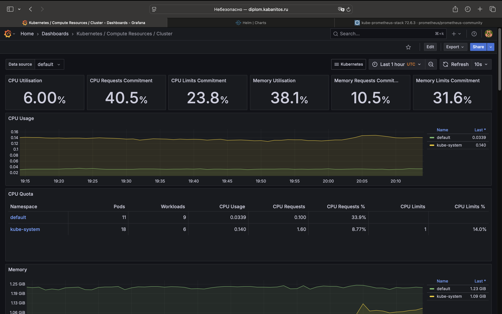

Так же данный манифест деплоит наше тестовое приложение в Kubernetes
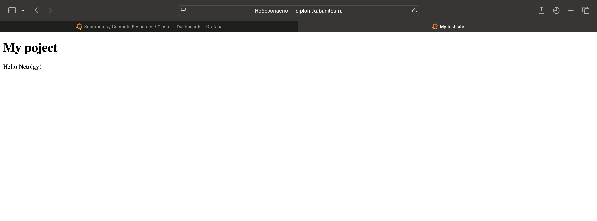

## Задание 5. Установка и настройка CI/CD.
Для деплоя сервиса Jenkins воспользуемся манифестом terraform из директории [jenkins](https://github.com/Kabanitos/netology-diplom/tree/main/jenkins)

Главная страница Jenkins
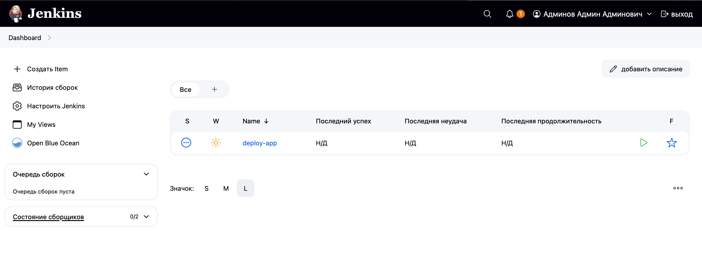

Был написан pipline jenkins, который находиться в репозитории [repo](https://github.com/Kabanitos/diplom-docker)

Сам [jenkinsfile](https://github.com/Kabanitos/diplom-docker/blob/main/jenkinsfile)

Как указано в задании данный pipline при коммите в репозиторий с тестовым приложением происходит сборка и отправка в регистр Docker образа.

Изменим файл index.html
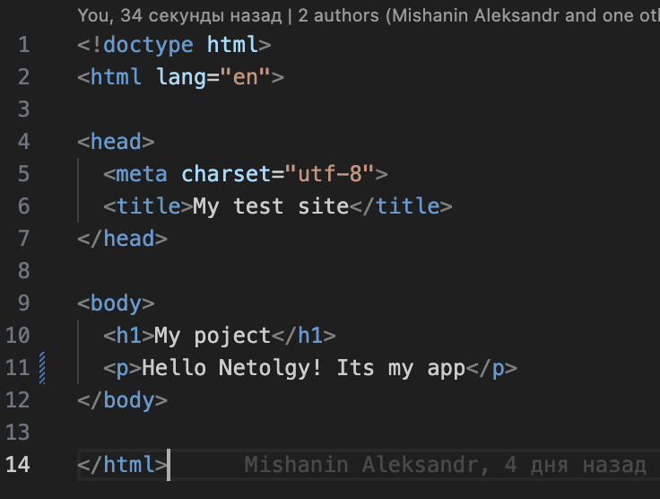

Запушим изменения в github
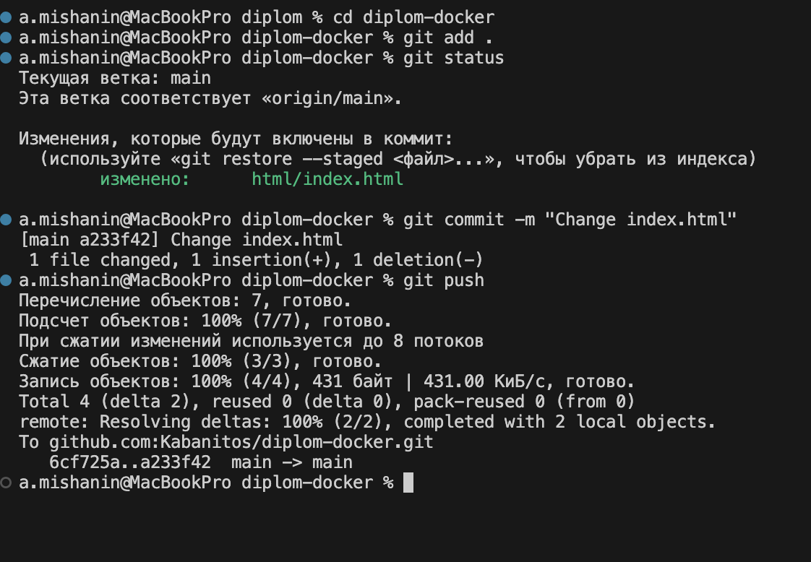

Как мы видим в лога jenkins наше приложение собирается и пушиться в DockerHub

Log Jenkins
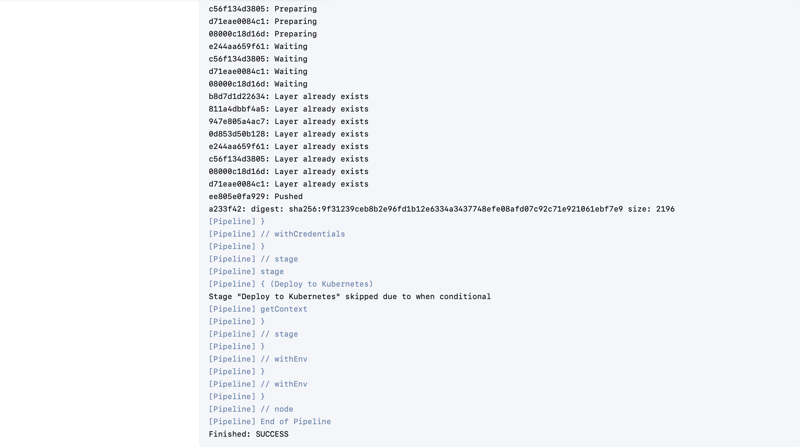

Приложение в DockerHub
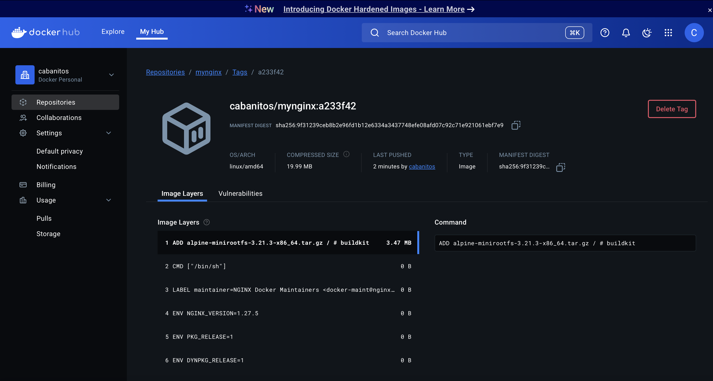

Так же есть следующее условие, что при создании тега (например, v1.0.0) происходит сборка и отправка с соответствующим label в регистри, а также деплой соответствующего Docker образа в кластер Kubernetes.

Изменим файл index.html
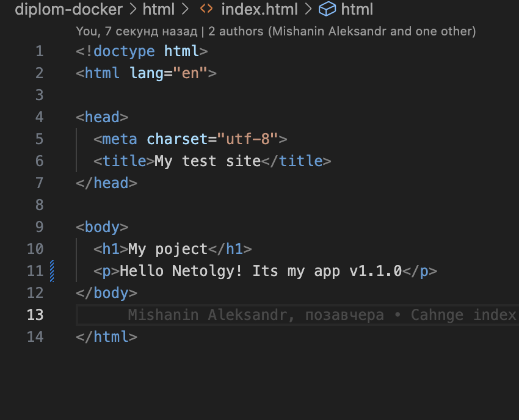

Запушим изменения в github указывая tag
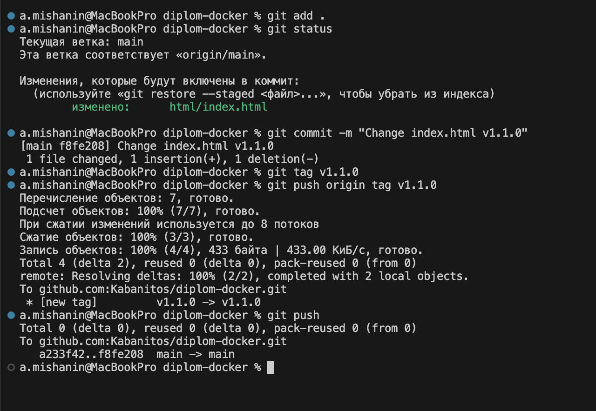

Log Jenkins
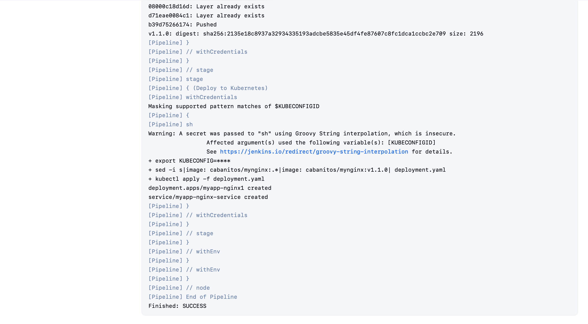

Приложение в DockerHub
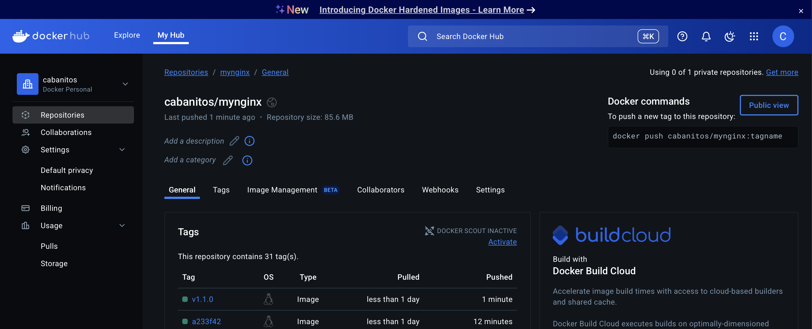

Развернутое приложение в Kubernetes
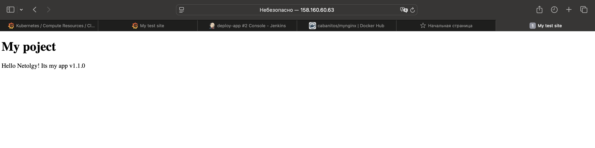

Ссылка на репозиторий для разворачивания [инфраструктуры](https://github.com/Kabanitos/netology-diplom/tree/main)

Ссылка на репозиторий тестового [приложения](https://github.com/Kabanitos/diplom-docker) 